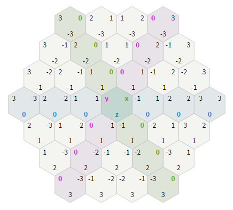
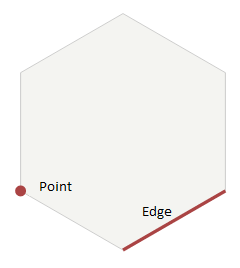
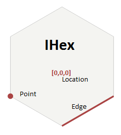

# YouTown

API for a boardgame to build towns, roads and cities.

## API
Provides primitive implementations to use as building blocks for implementation of a boardgame to build towns, roads and cities. Most of the game items have concrete implementations. This simplifies lookup and reasoning about them and should ultimately result in a simple API.

### Location
Currently, only one hexagonal system is implemented: the cube coordinate system. See [Hexagonal grids](http://www.redblobgames.com/grids/hexagons/) for more info. A standard 4 player board uses the following coordinates:



Three axis are used: the x, y and z axis. A coordinate (I really should use the term *triordinate* here) is simply called a `Location`.

A hexagon is represented as an `IHex` and contains implementations like `Pasture`, `Forest`, `Mountain` but also `RandomHex`. 
An `IHex` **has** a `Location`:

```csharp
    public interface IHex
    {
        Location Location { get; }
        // snip many more properties/methods
    }
```

Roads, towns and cities are placed on intersections of these hexagons:



An `Edge` uses two `Location`s as unique identification:

```csharp
    [TestMethod]
    public void Points_AreCorrect2Points()
    {
        var edge = new Edge(new Location(0,0,0), new Location(1, -1, 0));
        var points = edge.Points;

        Assert.IsTrue(points.Contains(new Point(new Location(0,0,0), new Location(1, -1, 0), new Location(1,  0, -1))));
        Assert.IsTrue(points.Contains(new Point(new Location(0,0,0), new Location(1, -1, 0), new Location(0, -1,  1))));
    }
```

A `Point` uses three `Location`s as unique identification.

```csharp
    var point = new Point(new Location(0,0,0), new Location(1, -1, 0), new Location(1,0,-1));
    var neighbors = point.Neighbors;

    Assert.AreEqual(3, neighbors.Count);
    Assert.IsTrue(neighbors.Contains(new Point(new Location(0,0,0), new Location(1, 0, -1), new Location(0, 1, -1))));
    Assert.IsTrue(neighbors.Contains(new Point(new Location(0,0,0), new Location(1, -1, -0), new Location(0, -1, 1))));
    Assert.IsTrue(neighbors.Contains(new Point(new Location(1,-1,0), new Location(2, -1, -1), new Location(1, 0, -1))));        
```

To summarize: A Hexagon is represented by an `IHex`, which has a `Location`. Vertices between hexagons are called `Point`. Edges between two hexagons are called `Edge`:



Examples:
- Can the player trade with the bank?

```csharp
    var resources = new ResourceList(new Timber, new Timber(), new Sheep(), new Clay());
    var ports = new PortList(new FourToOnePort, new ThreeToOnePort(), new TimberPort());
    var amountTradesWithBank = ports.AmountGold(resources)

    Assert.AreEqual(1, amountTradesWithBank);
```

- Create a new board and setup for play:

```csharp
    IBoard board = new ConcentricBoard(4);
    var chits = Standard4PBoard.Chitlist;
    var ports = Standard4PBoard.Portlist;
    var hexes = Standard4PBoard.Hexlist;
    var random = new DotNetRandom();
    IBoard boardNowReadyForPlay = board.Setup(hexes, chits, ports, random);
```

- Get neighbours of hexagon intersections (vertices)

```csharp
    var point = new Point(new Location(0,0,0), new Location(1, -1, 0), new Location(1,0,-1));
    var neighbors = point.Neighbors;

    Assert.AreEqual(3, neighbors.Count);
    Assert.IsTrue(neighbors.Contains(new Point(new Location(0,0,0), new Location(1, 0, -1), new Location(0, 1, -1))));
    Assert.IsTrue(neighbors.Contains(new Point(new Location(0,0,0), new Location(1, -1, -0), new Location(0, -1, 1))));
    Assert.IsTrue(neighbors.Contains(new Point(new Location(1,-1,0), new Location(2, -1, -1), new Location(1, 0, -1))));
```
